# Paper Plot Skills

这里是我自己在用的，一套用于**复现和生成学术论文图表**的 AI Skills 工具箱。  

我仔细选取了自己阅读过论文里绘图风格很有参考价值的各种图表，具有**很强的参考意义**，能极大程度**减少绘图时候的重复工作**。

这个仓库只是提供了一个起始点，从 9 张真实论文图表中提炼出系统化风格参数，支持**按风格填数据**和**从图片复现**两种使用方式。

这些skills会随着你的复现过程不断优化。

---

## 🎨 预置风格一览

| 风格 | 类型 | 来源论文 | 关键特征 |
|------|------|----------|---------|
| [`bar_paired_delta`](#bar_paired_delta) | 柱状图 | MemEvolve | 配对柱 + 增益箭头，serif 字体 |
| [`bar_grouped_hatch`](#bar_grouped_hatch) | 柱状图 | SPICE | 分组柱 + 斜线填充主方法，柱顶数值 |
| [`line_confidence_band`](#line_confidence_band) | 折线图 | Self-Distillation | EMA 平滑 + 置信区间阴影，LaTeX 字体 |
| [`line_training_curve`](#line_training_curve) | 折线图 | DAPO | 垂直断点线 + 水平参考线，sans-serif |
| [`line_loss_with_inset`](#line_loss_with_inset) | 折线图 | SiameseNorm | L 形 spine + 轴端箭头 + 右侧 zoom inset |
| [`scatter_tsne_cluster`](#scatter_tsne_cluster) | 散点图 | MemGen | t-SNE 聚类 + 圆角彩色注释框，点线网格 |
| [`scatter_broken_axis`](#scatter_broken_axis) | 散点图 | Meta-Harness | 折断 X 轴双面板，多 marker 类型 |
| [`radar_dual_series`](#radar_dual_series) | 雷达图 | DoRA | 正八边形虚线同心网格，双方法对比 |

---

## Skills

| Skill | 说明 | 触发方式 |
|-------|------|---------|
| [**plot-from-data**](plot-from-data/) | 选择上方任意风格，填入你的数据，生成 dpi=300 论文图 | "用 `bar_grouped_hatch` 风格画我的数据" |
| [**plot-from-image**](plot-from-image/) | 上传论文截图，自动分析比例/字体/配色并复现为 matplotlib 脚本 | "帮我复现这张图" |

---

## 风格图库 · Gallery

---

### 柱状图 Bar Charts

#### `bar_paired_delta` — 配对增益柱

> **来源**：MemEvolve: Meta-Evolution of Agent Memory Systems  
> serif 字体，配对柱（baseline vs method），箭头标注增益，Y 轴各子图独立  
> 参数文档：[`plot-from-data/references/bar_paired_delta.md`](plot-from-data/references/bar_paired_delta.md) · 脚本：[`plot-from-data/scripts/bar_memevolve.py`](plot-from-data/scripts/bar_memevolve.py)

<table><tr>
<td align="center"><b>原图</b></td>
<td align="center"><b>复现</b></td>
</tr><tr>
<td></td>
<td>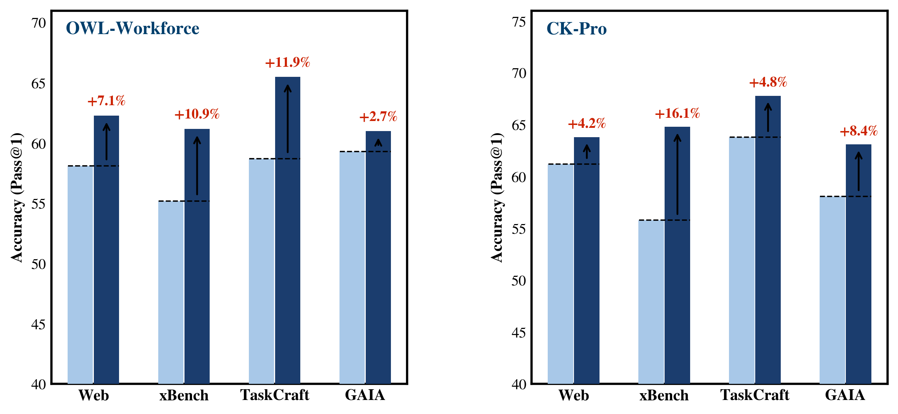</td>
</tr></table>

---

#### `bar_grouped_hatch` — 分组斜线填充柱

> **来源**：SPICE: Self-Play In Corpus Environments  
> LaTeX serif，分组柱 + 主方法白色斜线填充，柱顶数值（最优加粗），开口 L 形 spine  
> 参数文档：[`plot-from-data/references/bar_grouped_hatch.md`](plot-from-data/references/bar_grouped_hatch.md) · 脚本：[`plot-from-data/scripts/bar_spice.py`](plot-from-data/scripts/bar_spice.py)

<table><tr>
<td align="center"><b>原图</b></td>
<td align="center"><b>复现</b></td>
</tr><tr>
<td>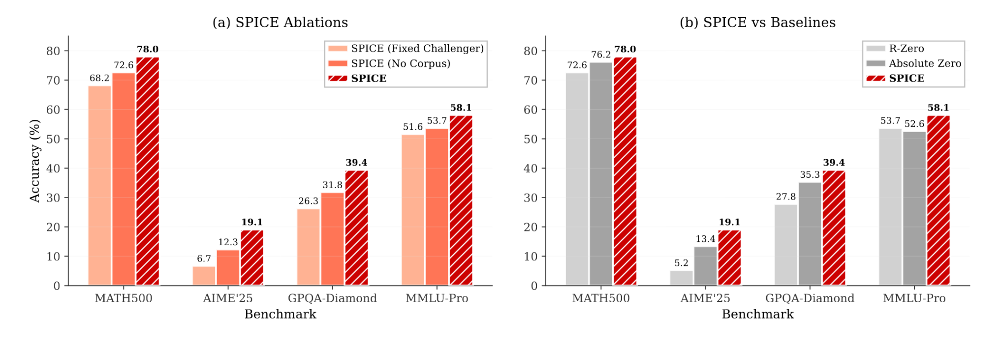</td>
<td>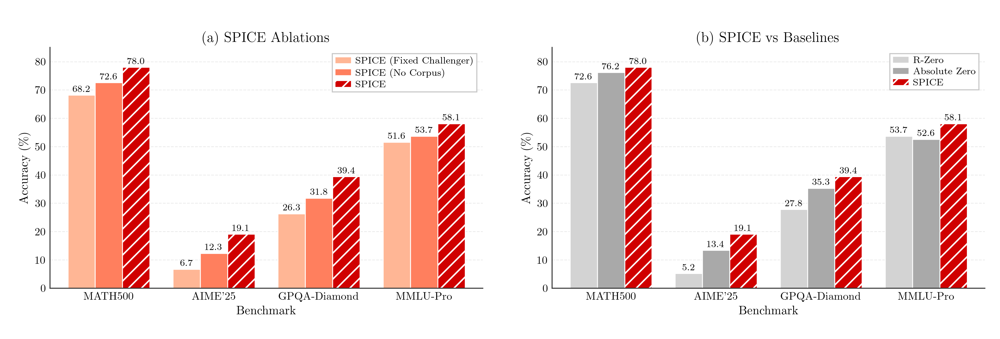</td>
</tr></table>

---

### 折线图 Line Charts

#### `line_confidence_band` — 置信区间训练曲线

> **来源**：Reinforcement Learning via Self-Distillation  
> LaTeX Computer Modern serif，EMA 平滑主线，浅色置信区间 `fill_between`，SDPO 加粗图例  
> 参数文档：[`plot-from-data/references/line_confidence_band.md`](plot-from-data/references/line_confidence_band.md) · 脚本：[`plot-from-data/scripts/line_selfdistill.py`](plot-from-data/scripts/line_selfdistill.py)

<table><tr>
<td align="center"><b>原图</b></td>
<td align="center"><b>复现</b></td>
</tr><tr>
<td>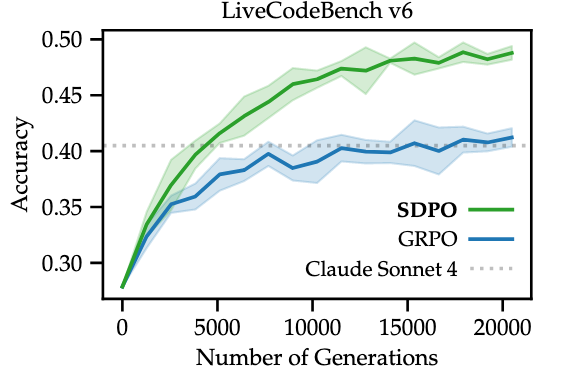</td>
<td>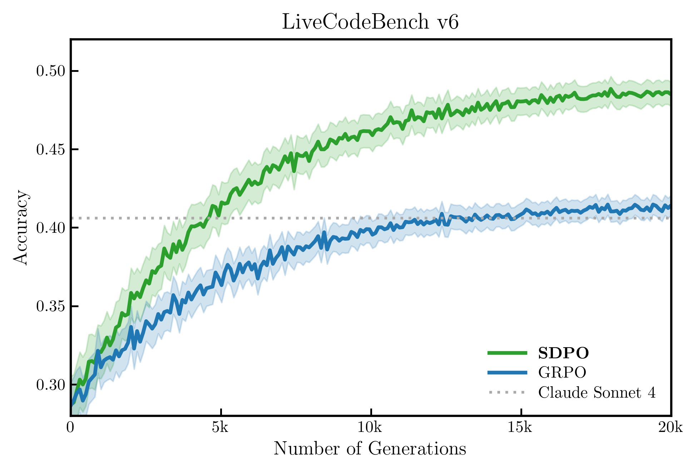</td>
</tr></table>

---

#### `line_training_curve` — 垂直断点 + 水平参考线

> **来源**：DAPO: An Open-Source LLM RL System at Scale  
> sans-serif，四边框，朝外刻度，水平参考线（独立蓝色），两条垂直断点虚线（与曲线同色）  
> 参数文档：[`plot-from-data/references/line_training_curve.md`](plot-from-data/references/line_training_curve.md) · 脚本：[`plot-from-data/scripts/line_aime.py`](plot-from-data/scripts/line_aime.py)

<table><tr>
<td align="center"><b>原图</b></td>
<td align="center"><b>复现</b></td>
</tr><tr>
<td>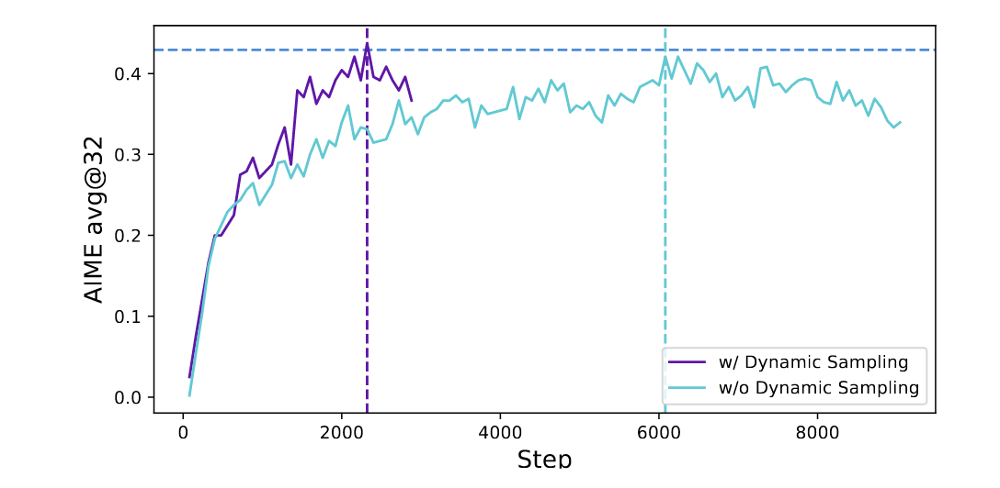</td>
<td>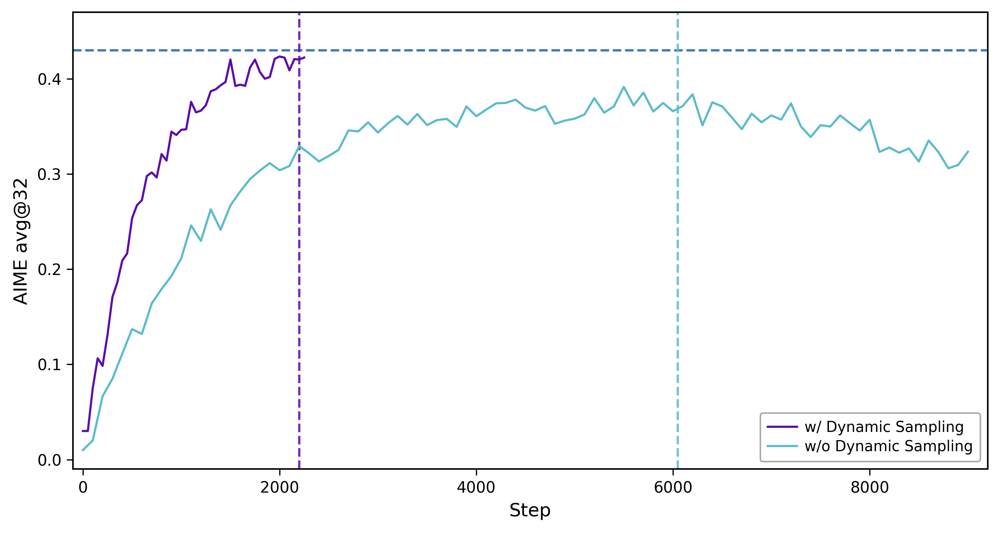</td>
</tr></table>

---

#### `line_loss_with_inset` — L 形 spine + 局部放大 inset

> **来源**：SiameseNorm: Breaking the Barrier to Reconciling Pre/Post-Norm  
> LaTeX serif，L 形 spine + 轴端箭头，虚线放大框，黑色虚线连接右侧独立 inset 子图  
> 参数文档：[`plot-from-data/references/line_loss_with_inset.md`](plot-from-data/references/line_loss_with_inset.md) · 脚本：[`plot-from-data/scripts/line_loss_inset.py`](plot-from-data/scripts/line_loss_inset.py)

<table><tr>
<td align="center"><b>原图</b></td>
<td align="center"><b>复现</b></td>
</tr><tr>
<td>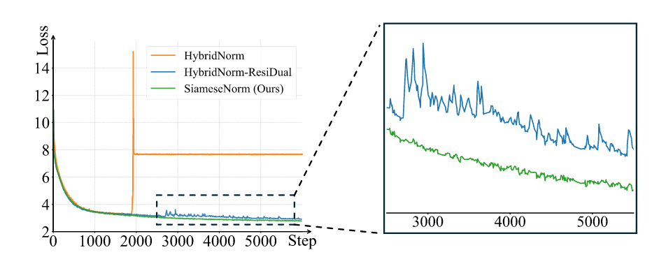</td>
<td>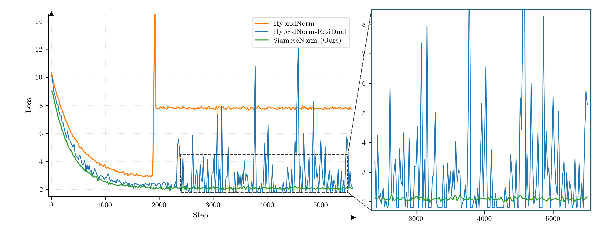</td>
</tr></table>

---

### 散点图 Scatter Plots

#### `scatter_tsne_cluster` — t-SNE 聚类分布

> **来源**：MemGen: Weaving Generative Latent Memory for Self-Evolving Agents  
> LaTeX serif，7 类聚类，圆角注释框（统一深灰边 + 聚类色底），浅灰点线网格，四边框  
> 参数文档：[`plot-from-data/references/scatter_tsne_cluster.md`](plot-from-data/references/scatter_tsne_cluster.md) · 脚本：[`plot-from-data/scripts/scatter_tsne.py`](plot-from-data/scripts/scatter_tsne.py)

<table><tr>
<td align="center"><b>原图</b></td>
<td align="center"><b>复现</b></td>
</tr><tr>
<td>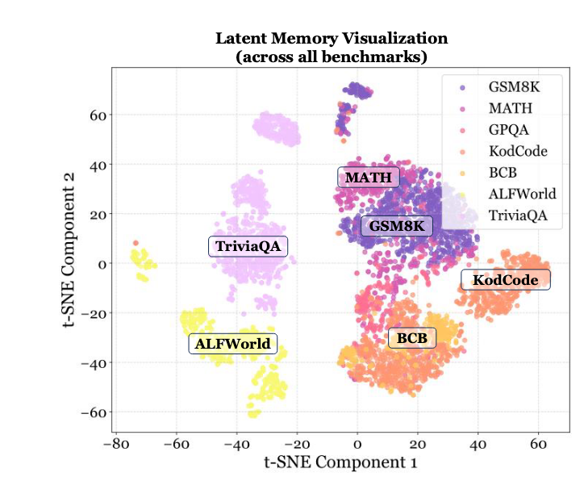</td>
<td></td>
</tr></table>

---

#### `scatter_broken_axis` — 折断 X 轴散点图

> **来源**：Meta-Harness: End-to-End Optimization of Model Harnesses  
> sans-serif 粗体标签，双面板折断 X 轴（0-50k | 115k/200k），多 marker（★ ○ △ ◆ × ○），折断符仅底边  
> 参数文档：[`plot-from-data/references/scatter_broken_axis.md`](plot-from-data/references/scatter_broken_axis.md) · 脚本：[`plot-from-data/scripts/scatter_break.py`](plot-from-data/scripts/scatter_break.py)

<table><tr>
<td align="center"><b>原图</b></td>
<td align="center"><b>复现</b></td>
</tr><tr>
<td>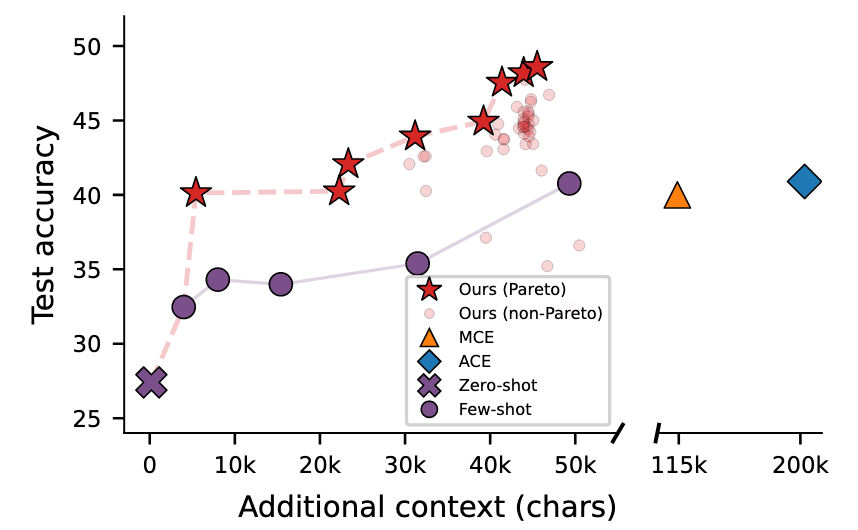</td>
<td>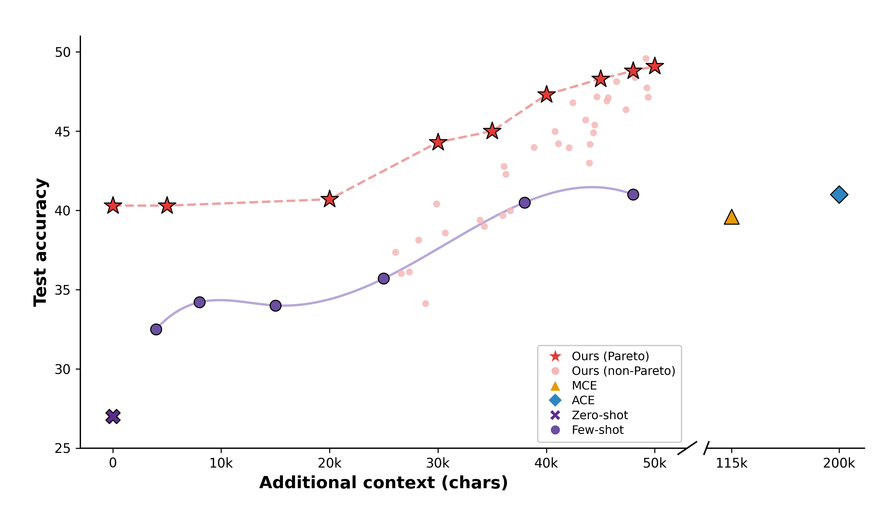</td>
</tr></table>

---

### 雷达图 Radar Chart

#### `radar_dual_series` — 双方法多维对比

> **来源**：DoRA: Weight-Decomposed Low-Rank Adaptation  
> sans-serif，正八边形虚线同心网格，DoRA 深绿粗线 vs LoRA 蓝色细线，数值标注白底，图例左上  
> 参数文档：[`plot-from-data/references/radar_dual_series.md`](plot-from-data/references/radar_dual_series.md) · 脚本：[`plot-from-data/scripts/radar_dora.py`](plot-from-data/scripts/radar_dora.py)

<table><tr>
<td align="center"><b>原图</b></td>
<td align="center"><b>复现</b></td>
</tr><tr>
<td>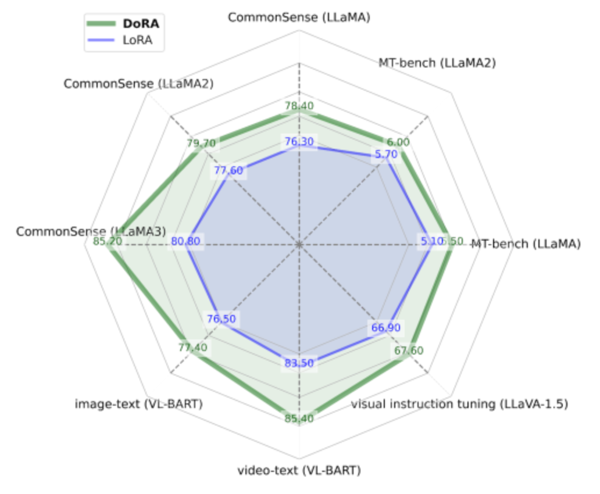</td>
<td>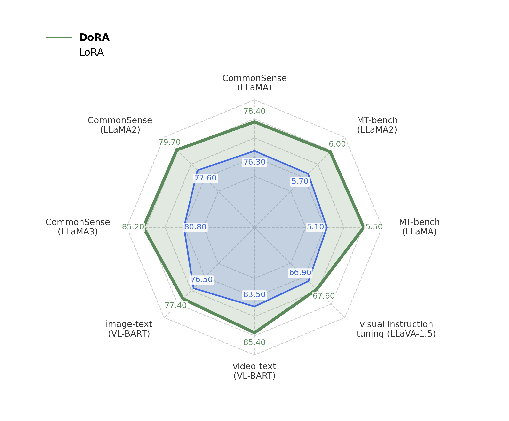</td>
</tr></table>
